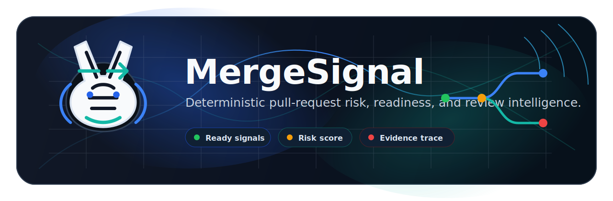
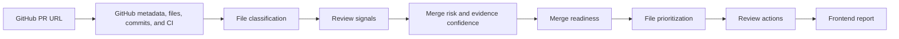

# MergeSignal

<p align="center">
  
</p>

<h1 align="center">
  
  <br>
  MergeSignal
</h1>

<p align="center">
  <strong>Deterministic pull-request risk, readiness, and review intelligence.</strong>
</p>

<p align="center">
  MergeSignal turns a public GitHub pull-request URL into an explainable snapshot of CI state, review signals, merge risk, evidence confidence, file priority, and reviewer actions.
</p>

<p align="center">
  <code>React 19</code>
  <code>FastAPI</code>
  <code>Python 3.13</code>
  <code>JavaScript</code>
  <a href="LICENSE"><code>MIT License</code></a>
</p>

<p align="center">
  <strong>Deployment-ready; public deployment pending.</strong>
</p>

<p align="center">
  <a href="#overview">Overview</a> |
  <a href="#features">Features</a> |
  <a href="#how-it-works">How it works</a> |
  <a href="#quick-start">Quick start</a> |
  <a href="#architecture">Architecture</a> |
  <a href="#documentation">Documentation</a> |
  <a href="#deployment">Deployment</a>
</p>

---

## Overview

Pull requests rarely fail for one obvious reason. Reviewers have to assemble scattered evidence from changed files, CI surfaces, metadata, patch visibility, and sensitive paths before they can decide where to focus.

| Review reality | MergeSignal response |
| --- | --- |
| Pull-request evidence is scattered across metadata, files, commits, patches, and CI. | Normalizes the current PR into one typed snapshot. |
| CI status alone does not explain review difficulty. | Separates CI state, merge risk, evidence confidence, and readiness. |
| Large, sensitive, opaque, or operational changes need deliberate attention. | Emits deterministic signals, ranked files, and evidence-backed review actions. |
| Review tools should be explainable. | Uses versioned rules and safe evidence, not generic AI commentary. |

> MergeSignal is built for review triage and merge-readiness visibility. It does not claim that a pull request is safe, correct, or bug-free.

## Features

| Analysis capability | Output |
| --- | --- |
| CI inspection | State and visibility for check runs and commit statuses on the PR head SHA |
| File classification | Kind, language, functional areas, rename metadata, and visibility context |
| Review signals | Evidence-backed deterministic findings from metadata, CI, classification, and patch hints |
| Merge risk | Explainable score, group caps, and signal-level contributions |
| Evidence confidence | Independent visibility and completeness assessment |
| Readiness | `ready`, `ready_with_caution`, `not_ready`, or `blocked` with structured reasons |
| File prioritization | Ordered changed-file review queue with deterministic factors |
| Review actions | Deterministic next-review prompts tied to current snapshot evidence |
| Frontend report | Overview, files, signals, actions, and evidence exploration |

## How It Works



MergeSignal fetches only the GitHub data needed for the current snapshot. It does not clone repositories, execute analyzed code, install dependencies, or make additional repository-content requests beyond the documented GitHub REST calls.

<details>
<summary>Pipeline boundary details</summary>

- The parse endpoint validates public GitHub PR URL shape without a network request.
- The snapshot endpoint fetches GitHub metadata, changed files, commits, check runs, and commit statuses.
- Classification, signals, scoring, readiness, file priority, and actions run from normalized in-memory models.
- Client-side report filters do not call GitHub or the backend again.

</details>

## Example Analysis

> Illustrative example only. This is a compact output shape, not a live result.

| Assessment | Result |
| --- | --- |
| Readiness | Blocked |
| Merge risk | 42 / 100 - Moderate |
| Evidence confidence | 92 / 100 - High |
| CI | Failing |
| Highest-priority file | `backend/auth/session.py` |
| Next review action | Inspect failing CI |

Scores are deterministic heuristics, not probabilities. Ready does not mean safe or bug-free.

## What Makes It Trustworthy

- Rules are deterministic and versioned.
- Outputs trace back to snapshot evidence, related signals, readiness reasons, or ranked files.
- Merge risk and evidence confidence remain separate.
- GitHub API usage is bounded by timeouts, retries, pagination limits, and safe pagination-host checks.
- Credential-like findings never return suspected secret values or full suspicious source lines.
- The system does not clone repositories, execute analyzed code, or install dependencies.
- Review actions are deterministic prompts, not AI-generated code-review commentary.

---

## Quick Start

### Backend

```bash
cd backend
python3 -m venv .venv
source .venv/bin/activate
python -m pip install -r requirements-dev.txt
cp .env.example .env
.venv/bin/python -m uvicorn app.main:app --reload
```

Backend local URL:

```text
http://127.0.0.1:8000
```

Health check:

```text
http://127.0.0.1:8000/health
```

### Frontend

Node.js 22 is required.

```bash
nvm use
cd frontend
npm install
cp .env.example .env
npm run dev
```

Frontend local URL:

```text
http://127.0.0.1:5173
```

## Usage

1. Start the backend.
2. Start the frontend.
3. Paste a public GitHub pull-request URL.
4. Run analysis.
5. Review the Overview, Files, Signals, Actions, and Evidence tabs.

Private repositories are not supported by default. They require suitable backend GitHub access, and the current product does not include GitHub App installation or user authentication.

---

## Architecture

| Layer | Responsibility |
| --- | --- |
| React/Vite frontend | PR input, safe loading/error states, detailed report navigation, client-side filters |
| FastAPI backend | Health, URL parsing, snapshot API, typed response contracts |
| GitHub client | Async REST retrieval with bounded retries, timeouts, pagination, and sanitized errors |
| Analysis pipeline | Classification, signals, risk, confidence, readiness, file priority, and review actions |
| Current infrastructure | Stateless app flow with no database, Redis, workers, or persistence required |

Read the detailed architecture notes in [docs/architecture.md](docs/architecture.md).

## Technology Stack

| Area | Stack |
| --- | --- |
| Frontend | React, Vite, React Router, JavaScript, plain CSS |
| Backend | Python, FastAPI |
| GitHub integration | HTTPX async client over GitHub REST |
| Validation and models | Pydantic, Pydantic Settings |
| Testing | Pytest, Vitest, React Testing Library, mocked HTTPX/GitHub fixtures |
| Deployment target | Render backend, Vercel frontend |

## Testing

Backend:

```bash
cd backend
.venv/bin/python -m pytest
.venv/bin/python -m compileall app tests
```

Frontend:

```bash
cd frontend
npx -p node@22 -c "npm install"
npx -p node@22 -c "npm test -- --run"
npx -p node@22 -c "npm run build"
npx -p node@22 -c "npm audit --audit-level=moderate"
```

Automated tests use local fixtures, dependency overrides, and mocked HTTP clients. They do not call the live GitHub API.

## Deployment

Deployment configuration is included, but public deployment is pending.

- Backend target: Render, configured by [render.yaml](render.yaml).
- Frontend target: Vercel, configured by [frontend/vercel.json](frontend/vercel.json).
- Production frontend builds require `VITE_API_BASE_URL`.
- Production backend CORS uses an explicit `MERGE_SIGNAL_CORS_ORIGINS` allowlist.

See [docs/deployment.md](docs/deployment.md) for the manual deployment sequence, environment variables, smoke test, rollback notes, and troubleshooting.

## Documentation

Product and architecture:

- [Product scope](docs/product-scope.md)
- [Architecture](docs/architecture.md)
- [API](docs/api.md)

Analysis pipeline:

- [GitHub integration](docs/github-integration.md)
- [CI surface](docs/ci-surface.md)
- [File classification](docs/file-classification.md)
- [Review signals](docs/review-signals.md)
- [Scoring](docs/scoring.md)
- [Merge readiness](docs/merge-readiness.md)
- [File prioritization](docs/file-prioritization.md)
- [Review actions](docs/review-actions.md)

Frontend:

- [Frontend](docs/frontend.md)

Operations:

- [Deployment](docs/deployment.md)

## Current Boundaries

The current version does not include:

- Authentication.
- GitHub App installation.
- Private-repository access by default.
- History, persistence, or saved reports.
- CODEOWNERS evaluation.
- Repository policy evaluation.
- Generated code fixes.
- Automatic reviewer assignment.

## Roadmap

- Public deployment.
- GitHub App integration.
- Persisted analysis history.
- Pull-request comparison.
- CODEOWNERS and repository policy support.

## Security And Trust Model

MergeSignal treats pull-request URLs and repository data as untrusted inputs. Analyzed repositories are not cloned or executed, dependencies from analyzed repositories are not installed, and patch evidence is sanitized before it appears in outputs.

Tokens are backend-only. Frontend environment variables must not contain secrets. API errors are sanitized, and credential-like findings never return raw suspected values.

For details, see [docs/github-integration.md](docs/github-integration.md), [docs/review-signals.md](docs/review-signals.md), and [docs/deployment.md](docs/deployment.md).

## License

MergeSignal is available under the [MIT License](LICENSE).
